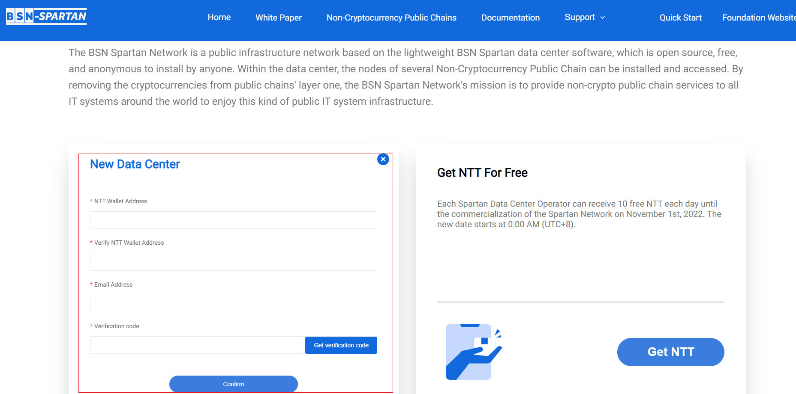
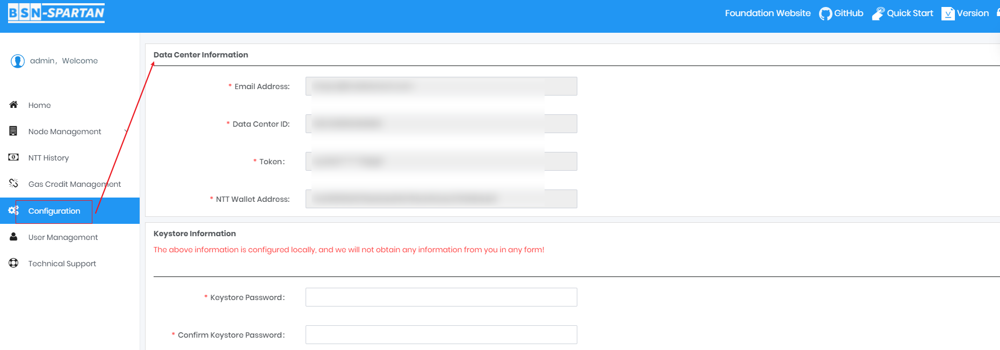
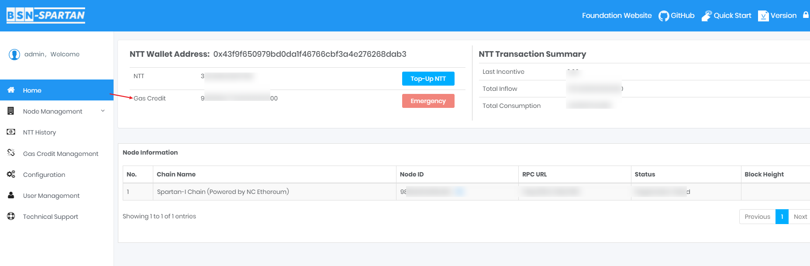
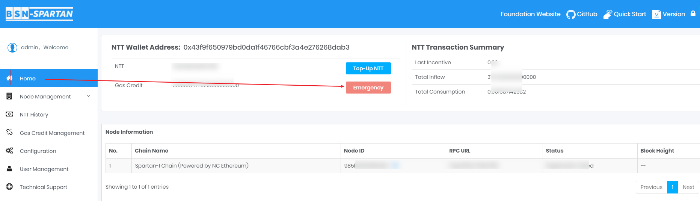
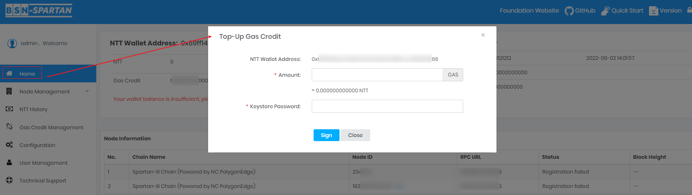
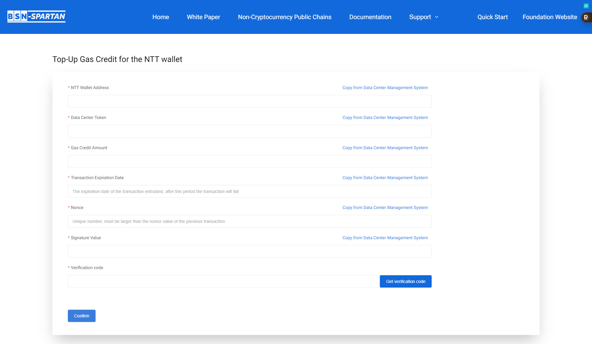

# Register Data Center

Go to the Spartan Foundation Portal to register as an data center, you will get your unique Data Center ID and Data Center Token, which will secure your business security and provide you with incentives from the NTT economic system.	

 

## Initiate the Application
---
	
Visit https://spartan.bsn.foundationand select "Join Spartan" to register as an data center.

- Enter your NTT Wallet address;

- Double check your NTT Wallet address;

> [!note]
> ***Please make sure the wallet address you entered is correct, it will be your unique data center wallet to manage your NTT assets!***

- Enter an email address;

> [!note]
> ***The Governance System will send important information such as official business notices to this Email address, please ensure that you can obtain relevant information!***

- Check your mailbox for a verification message with a one-time verification code;

- Enter the verification code and click **"Confirm"** button.

- You will be notified by email after the Governance System complete the registration process.

 

## Check the email of the Notification of your application
---

The whole process could take a while because it needs to upload your registration information to the chain. After completion, we will send you an email to notify you of the registration result. If the registration is successful, the email will inform you with your Data Center ID and Token.

 

## Data Center ID and Token Configuration
---

Your Data Center ID and Token will be used when the Data Center Management System interacts with the Spartan official contracts on the Default Chain.

**Log in to the BSN Spartan Data Center Software, click on "Configuration" on the panel and open the page:**

- Enter the email address you filled in when you registered;

- Enter your Data Center ID got from the notification email of Data Center registration；

- Data Center Token got from the notification email of Data Center registration；

- Enter your NTT Wallet;

> [!note]
> ***TPlease make sure the wallet address you entered is correct, it will be your unique data center wallet to manage your NTT assets!***

- Click **"Save"** button.

Now you have configured the registration information to your local server.

> [!danger|style:flat]
> ***The above information is configured locally, and we will not obtain any information from you in any form!***

 

## Check Your Gas Credit Balance
---
	
After successfully registration, we will send 1NTT worth of Gas Credit to your NTT Wallet, so that your NTT Wallet has the basic conditions to interact with the Default Chain. Normally your NTT Wallet will receive it within 30 minutes. Please make sure that the Gas Credit balance of your NTT Wallet is higher than the amount required to complete at least one Gas Credit Top-up, otherwise your NTT Wallet will not be able to initiate transactions normally.

**Log in to the BSN Spartan Data Center Software, click on "Home" on the panel and open the page:**

 

## 2.1.4.5 Emergency Top-Up Gas Credit! (Opentional)
---

When your NTT Wallet balance cannot complete a normal Top-up transaction, you can use the Emergency Gas Credit Top-up to consume your NTT to Top-up the Gas Credit of your NTT Wallet once. Note that this function can only be used when your NTT Wallet’s Gas Credit balance is less than the amount of Gas Credit equivalent to 0.03 NTT, and there are restrictions on the frequency of use. When using this function, you need to submit your signed information to the corresponding page of the Spartan official portal. Your private key management and the entire signing process are completed locally.

**Log in to the BSN Spartan Data Center Software, click on "Home" on the panel and open the page:**

- **Click "Emergency ":**

- Confirm NTT Wallet address , enter the amount of Gas Credit for top-up;

- Enter Keystore Password;

- Click **"Sign".**

Verify the signature information on the page, click submit, and jump to the foundation website, enter the signature value generated in the signature information.

> [!note|style:flat]
>**Please make sure that the information entered above is consistent with the information generated as signature information in your data center system. Otherwise, the transaction will not be successful.**

 
 
 