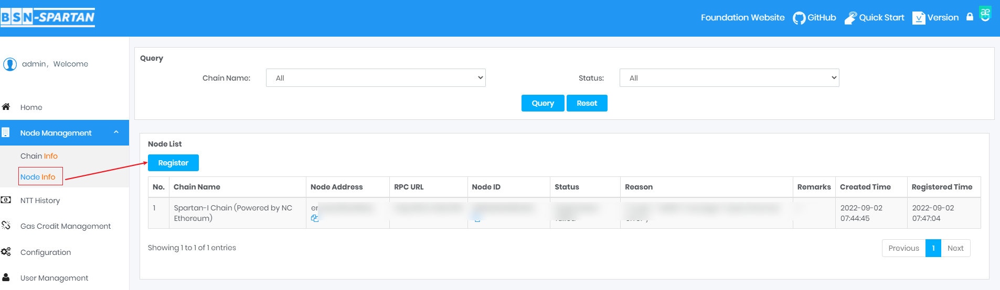
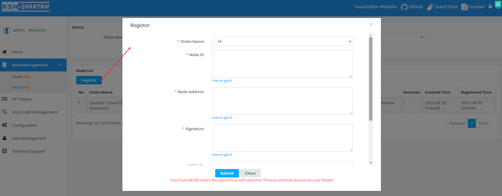
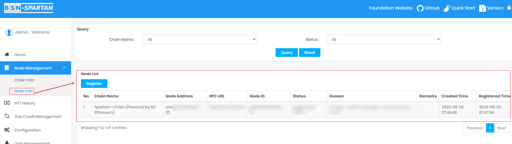

# Register Default Node

	
After the Node registration, you will receive incentives by the Node Establishment Incentive Program. And you can also monitor the status of the node at any time in your Data Center Management System.

 

## Submit the registration application
---

Use your Data Center Management System for node registration, and the management system will call the Spartan Node Management Contract to register your node information on the chain. Choose Spartan-I as the target chain.

### Operation Steps:

**Click "Node Management"-> "Node Info" on the panel to enter the page:**

**Click "Register"button:**

- Select Chain Name: Choose Spartan-I as the target chain;

- Enter the Node ID which is generated at the Node deployment；

- Enter the Node Address which is generated at the Node deployment；

- Enter Signature which is generated at the Node deplyment；

- Enter the RPC URL, for the node monitoring service；

- Supply the keystore password；

- Click the "Submit" button, the backend timing task will submit the node information to the chain directly and wait for the chain to carry out the Node Registration Test (This will normally takes several hours but no more than 10 hours), we will send the result to the Data Center’s email address. 

 

## Check the email of the Notification of Submission
---

You will receive an email to inform you if your application was successfully submitted . If it is successful, your node will be tested for registration; if it fails, please resubmit the application.

 

## Check the email of the Notification of Registration Test
---

Keep your node in a state of stable connection to the network. If your node fails to pass the test, please check your node and network status, you can submit the application again for another test.

 

## Check your Node Management List and your Node Status
---

	
Now your node information has been recorded on the chain, and you can find your node in the Node Management List.

### Operation Steps:

**Click "Node Management"-> "Node Info" on the panel to enter the page:**

In the list of nodes, you will see the status of all registered nodes. Node search function is also available.

 

## Check your NTT Balance
---

Node Establishment Incentive will be sent to your NTT Wallet.

### Operation Steps:

**Click "Home" on the panel to enter the page, check your NTT Balance.**

**You can also click "NTT History" to view transactions history of the NTT Wallet:**

 
 
 