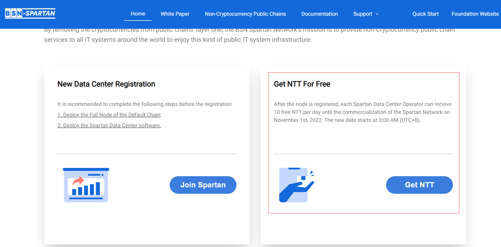
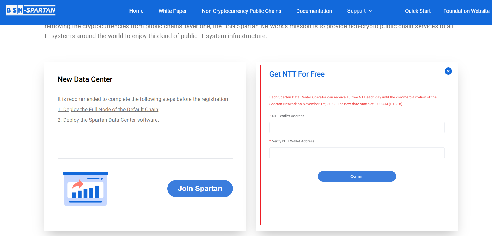
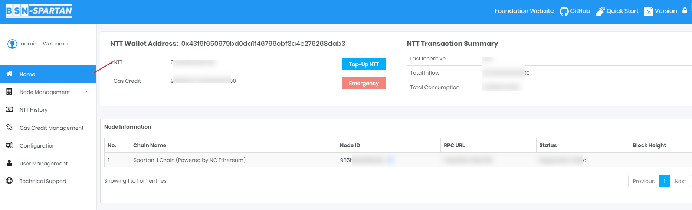

# Get NTT

	
You can use fiat currency or USDC to buy NTT.

> [!danger|style:flat]
> ***The purchase service will not be available until November 1st, 2022, and you can apply for receiving 10 NTT for free on the Spartan official portal every day.***

 

## Apply to get free NTT(Before Nov.1st)
---

Each Spartan Data Center Operator can get 10 NTT for free each day until the commercialization of the Spartan Network on November 1st, 2022. The new date starts at 0:00 AM (UTC+8).

### Operation Steps:

Visit https://spartan.bsn.foundationand and click **"Get NTT"**:

- Enter the NTT Wallet address;

- Confirm the NTT Wallet address;

- Click **"Confirm"** button.

 

## NTT Top-Up（After Nov.1st）
---

NTT can be purchased with fiat currency or designated stablecoins.

 

## Check the email of NTT Arrived
---

You will receive an email notification when NTT is credited.	
	

 

## Check your NTT Balance
---

Check your balance to confirm.NTT issuance is an on-chain operation, and there is a certain delay.

### Operation Steps:

**Click on "Home" on the panel to enter the page, check your NTT Balance.**

 
 
 

