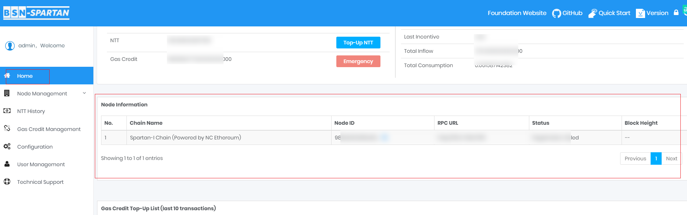

# List of Daily Common Operations

 

## Node Status Monitoring
---

		
Monitor your node status at any time to ensure that the node is in a normal state.

### Operation Steps:

**Click "Home" on the panel to enter the dashboard:**

 

## NTT Wallet Balance Monitoring
---

Monitor your NTT Wallet balance information at any time to avoid transaction failure caused by low balance. If your NTT Wallet’s Gas Credit balance is too low to make a normal transaction, you can use the Emergency Gas Credit Top-Up.	

**You can monitor your NTT Wallet balance and Gas Credit Wallet.**

 

> [!Tip|style:flat]

> Reference: [**Apply to get free NTT**](../6GetNTT/6.md#1) in Get NTT.

> Reference: [**Emergency Top-Up Gas Credit!**](../4DataCenterRegistration/4.md#5) in Registrer Data Center.

 

## Top-Up Gas Credit
---
	
Make Gas Credit Top-Up for your users’ wallets.

 

> [!Tip|style:flat]
> Reference: [**Top-Up Gas Credit**](../7GasCreditTop-up/7.md).

 

## Additional Spartan-I Chain Node Establishment
---

Establish a new Spartan-I Chain (Powered by NC Ethereum) node.

 

> [!Tip|style:flat]

> Download the binary package and source code from [**here**](https://github.com/BSN-Spartan/NC-Ethereum).

> Reference: [**Installation**](https://spartan.bsn.foundation/static/quick-start/4learnNon-CryptocurrencyPublicChains/4-1.html#2) in Spartan-I Chain (Powered by NC Ethereum).

 

## Additional Spartan-II Chain Node Establishment
---

Establish a new Spartan-II Chain (Powered by NC Cosmos) node.

 

> [!Tip|style:flat]

> Download the binary package and source code from [**here**](https://github.com/BSN-Spartan/NC-Cosmos).

> Reference: [**Installation**](https://spartan.bsn.foundation/static/quick-start/4learnNon-CryptocurrencyPublicChains/4-2.html#2) in Spartan-II Chain (Powered by NC Cosmos).

 

## Additional Spartan-III Chain Node Establishment
---

Establish a new Spartan-III Chain (Powered by NC PolygonEdge) node.

 

> [!Tip|style:flat]

> Download the binary package and source code from [**here**](https://github.com/BSN-Spartan/NC-PolygonEdge).

> Reference: [**Installation**](https://spartan.bsn.foundation/static/quick-start/4learnNon-CryptocurrencyPublicChains/4-3.html#2) in Spartan-III Chain (Powered by NC PolygonEdge).

 
 
 